# LFSR Multichannel Sound

**CPU-free hardware synthesis and spatialization with linear feedback shift registers.**

A hardware pseudorandom-sequence system for multichannel sound. A linear feedback shift register (LFSR), built from ordinary logic chips, generates pseudorandom bit streams whose clock rate and feedback taps determine both the *sound* and its *spatial distribution* across a loudspeaker constellation. Synthesis and spatialization are coupled in the hardware itself, with no CPU in the signal path.

This repository is a concept overview of the approach: what it is, how it works, and short demonstrations of it running. The hardware itself is under active development. The early discrete-logic prototype is being reworked, and current research and testing center on an FPGA implementation, alongside a custom-silicon version built via Tiny Tapeout. Detailed designs, verified results, and fuller documentation will follow as the work matures.

> Status: ongoing research project. Presented at AudioMostly 2022 (St.&nbsp;Pölten).

<picture>
  <source media="(prefers-color-scheme: dark)"  srcset="assets/img/diagrams/architecture-dark.svg">
  <source media="(prefers-color-scheme: light)" srcset="assets/img/diagrams/architecture-light.svg">
  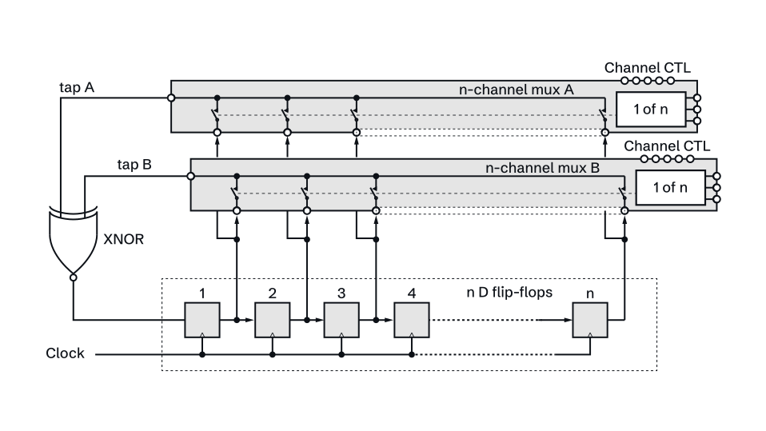
</picture>

*System architecture: an n-stage shift register with XNOR feedback, two n-channel multiplexers for dynamic tap and output selection, and parallel register outputs feeding a multichannel loudspeaker system.*
 

## Background

Logic chips are a familiar material in electronic music, where they have long been used to build oscillators, sequencers and noise sources. This project uses one such circuit, the linear feedback shift register, as the basis for both sound synthesis and spatial composition at once.

Working in hardware rather than software is a deliberate choice. There is no buffering latency, so the system reacts immediately to events; modulation can run well into the MHz range, far above any audio sample rate; and, most important here, a large number of register outputs (more than 32) are directly accessible in parallel for multichannel use. Because each output is a phase-shifted copy of the same sequence, changing the sound necessarily changes how it is distributed in space. Sound and space are two readings of the same circuit.

The sonic range is wide: from individual clicks at slow clock rates, through grainy textures and stuttering tonal loops, to pink and white noise at high rates.

## Principle of operation

### Linear feedback shift registers

An LFSR is a chain of D flip-flops clocked in step. Feedback is formed by taking two or more bits from within the chain, adding them modulo&nbsp;2 (an XOR, or an XNOR for the inverted sequence), and feeding the result back to the first stage. Because the number of states is finite, the output is deterministic and repeats after a fixed period.

<picture>
  <source media="(prefers-color-scheme: dark)"  srcset="assets/img/diagrams/basic-lfsr-dark.svg">
  <source media="(prefers-color-scheme: light)" srcset="assets/img/diagrams/basic-lfsr-light.svg">
  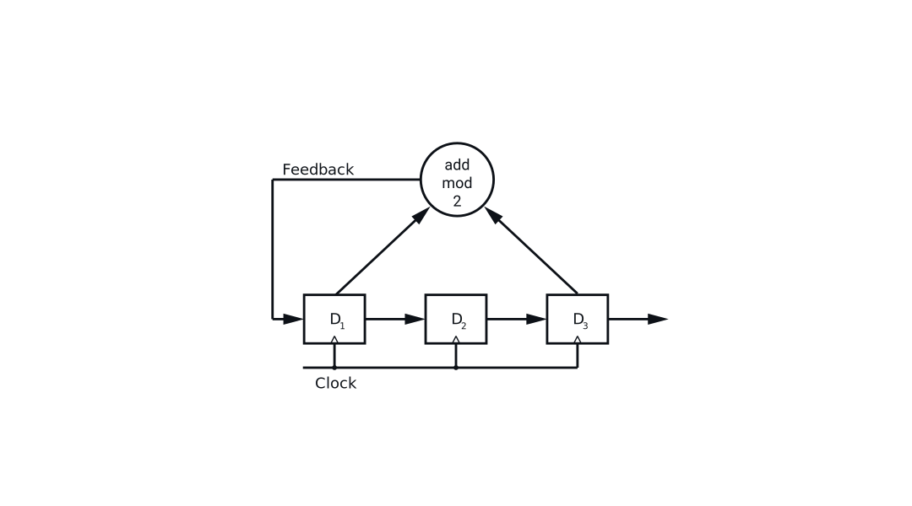
</picture>

A *Galois* configuration places the feedback between stages; a *Fibonacci* configuration (used by the discrete prototype) does the addition externally. Both reach the same sequence lengths.

<picture>
  <source media="(prefers-color-scheme: dark)"  srcset="assets/img/diagrams/galois-lfsr-dark.svg">
  <source media="(prefers-color-scheme: light)" srcset="assets/img/diagrams/galois-lfsr-light.svg">
  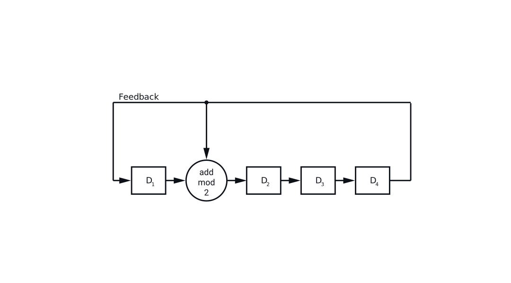
</picture>

### Maximum length sequences

Feedback taps that follow a primitive polynomial produce a *maximum length sequence* (MLS) of length 2&#8319;&nbsp;&minus;&nbsp;1, the longest possible before repeating. MLS have near-perfectly balanced ones and zeros and are maximally uncorrelated with shifted copies of themselves (Golomb), which is what makes them read as noise and decorrelate cleanly across channels. A 32-stage two-tap LFSR has 496 possible tap pairs, only a few of which produce a maximum-length sequence.

### Seeding and lock-up

Each stage must start from a non-trivial seed. With XOR feedback the all-zero state is forbidden (it locks the output at zero); with XNOR it is the all-ones state. A small detector circuit spots the forbidden state and forces an escape, which extends the usable sequence to a full 2&#8319;.

<picture>
  <source media="(prefers-color-scheme: dark)"  srcset="assets/img/diagrams/lock-up-elimination-dark.svg">
  <source media="(prefers-color-scheme: light)" srcset="assets/img/diagrams/lock-up-elimination-light.svg">
  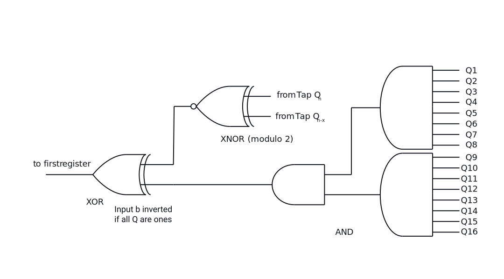
</picture>

## Sound and space

### Sonic palette

Clock rate and sequence length are the two primary controls. Below roughly 10&nbsp;Hz a long sequence produces random clicks; above about 50&nbsp;Hz it becomes grainy; above 10&nbsp;kHz it turns into noise. Short sequences at audio rates give tonal and rhythmic loops. Two different sequences over two speakers interlock into cross-rhythms that sound markedly less random than either alone.

The register length itself can be changed live with a multiplexer, whose binary select input can be driven by control logic, by pushbuttons, or by a second LFSR for pseudorandom tap selection.

<picture>
  <source media="(prefers-color-scheme: dark)"  srcset="assets/img/diagrams/variable-lfsr-mux-dark.svg">
  <source media="(prefers-color-scheme: light)" srcset="assets/img/diagrams/variable-lfsr-mux-light.svg">
  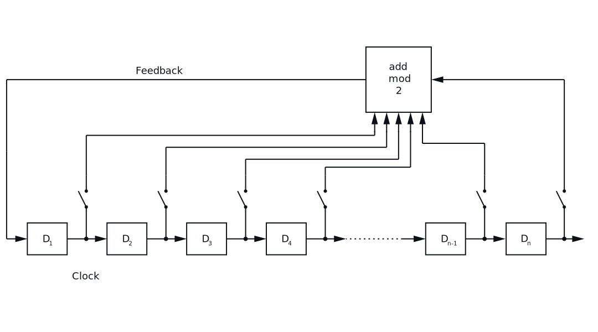
</picture>

### Spatial distribution

Each successive register holds the previous register's state, so every output carries the same sequence delayed by one clock step. Mapping registers to loudspeakers turns these phase offsets into spatial motion: short delays give reverberant, phase-shifting effects; longer delays give rhythmic patterns at slow rates and whirring sound clouds at high rates. Used as a demultiplexer, one register's output can instead be scanned around the ring one speaker at a time.

<picture>
  <source media="(prefers-color-scheme: dark)"  srcset="assets/img/diagrams/16-channel-ring-dark.svg">
  <source media="(prefers-color-scheme: light)" srcset="assets/img/diagrams/16-channel-ring-light.svg">
  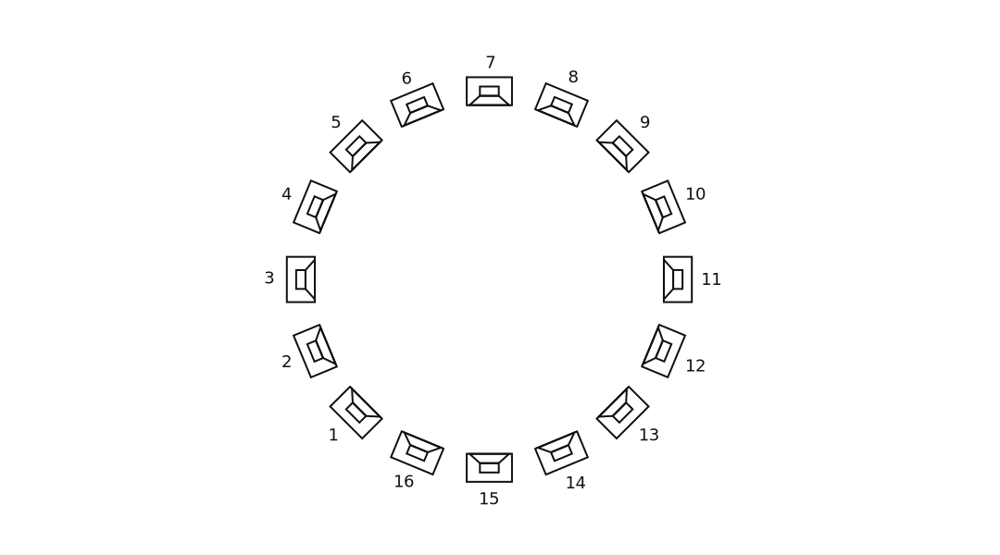
</picture>

### Variations and modulation

Beyond clock rate and sequence length, a few further controls shape the result:

- **Clock modulation.** The clock can be modulated with pulse-width modulation (PWM), frequency modulation (FM), or the trigger pulses of an analog sequencer, so the texture shifts continuously instead of sitting at a fixed rate.
- **Coupled LFSRs.** Feeding the pseudorandom bit stream of a second LFSR into the clock input of the first couples the two registers; two LFSRs at different clock rates build markedly more complex, less predictable rhythms. This is the same coupling later built into the custom chip.
- **Freezing the feedback.** Stopping the feedback and letting the stored bits rotate shortens the active sequence and breaks smaller loops out of a longer one.

In one two-channel demonstration, a 31-stage and a 29-stage maximum-length sequence (lengths 2,147,483,647 and 536,870,911) clocked at 5&nbsp;Hz interlock into cross-rhythms that read as far less random than either sequence alone.

## Demonstrations

Short clips of the running system, with sound. (The second clip keeps its unusually wide, oscilloscope-style format.)

**Aperiodic sequence** (taps 30 and 27, 10&nbsp;Hz, 8 speakers, one LFSR):

https://github.com/user-attachments/assets/fcb2e124-fce3-4289-be17-752d0ce55ec4

**Periodic sequences** (taps 12-8 and 9-7, 10&nbsp;Hz and 60&nbsp;Hz, 16 speakers, two LFSRs):

https://github.com/user-attachments/assets/4ab66972-c502-4622-a475-0d26bd8bbea4

The compressed source files are in [`assets/video/`](assets/video/).

## Implementation

**Discrete logic boards.** A stack of SMD shields with stacking headers: a shift register with XNOR feedback, two 32-channel analog multiplexers (ADG732), and a lock-up-protection board. Register outputs are broken out on 8-channel Sub-D 25 connectors for patching to the loudspeaker system. Key ICs are the CD4094B shift register, CD4077B XNOR, ADG732 multiplexer, CD4068B AND/NAND, and a 555-type timer for the clock.

<picture>
  <source media="(prefers-color-scheme: dark)"  srcset="assets/img/diagrams/board-example-dark.webp">
  <source media="(prefers-color-scheme: light)" srcset="assets/img/diagrams/board-example-light.webp">
  
</picture>

*Example board layout from the discrete-logic prototype.*
 

**FPGA.** An iCE40 FPGA (the same device family Tiny Tapeout uses for its FPGA work) provides a reconfigurable, scalable route. The logic-gate structure can be multiplied and elaborated in place: many parallel LFSRs, longer registers, and richer coupled feedback, all without re-spinning physical hardware, which suits larger and more complex multichannel setups.

**Custom silicon.** The LFSR core re-implemented as a real chip in Verilog and laid out by the open-source flow (LibreLane) on the SKY130 process via [Tiny Tapeout](https://tinytapeout.com). The first build passed all Tiny Tapeout prechecks, with an added de Bruijn feedback modification (full 2&#8319; sequences) and a coupled modulator LFSR for pseudorandom output-tap hopping. This layout is a work in progress, not the final version. Chip repository: **[SCLW/tt-lfsr32](https://github.com/SCLW/tt-lfsr32)**.

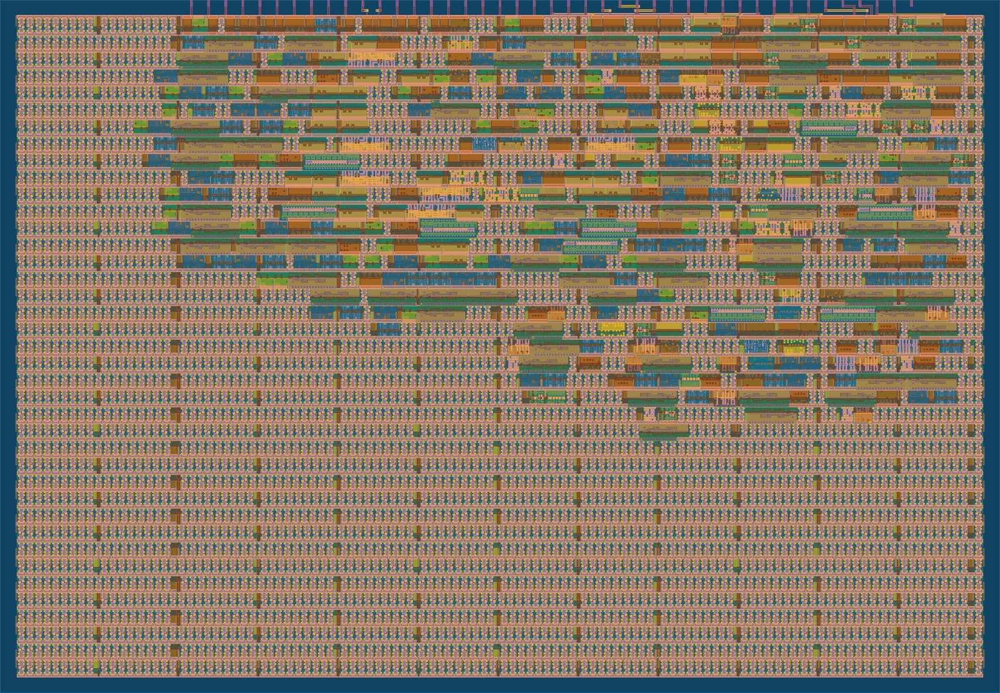

*GDS layout render of the 32-stage LFSR core on Tiny Tapeout (SKY130). Work in progress, not the final layout.*
 

## Further work

This remains a work in progress, and several directions stay open: a systematic study of the variation and modulation techniques above; an interface design with inlets, switches, and control elements for live performance; and a strategy for integrating the synthesis-and-spatialization approach into a modular system. The longer-term aim is to use it compositionally in electronic music.

## Photographs

<!--
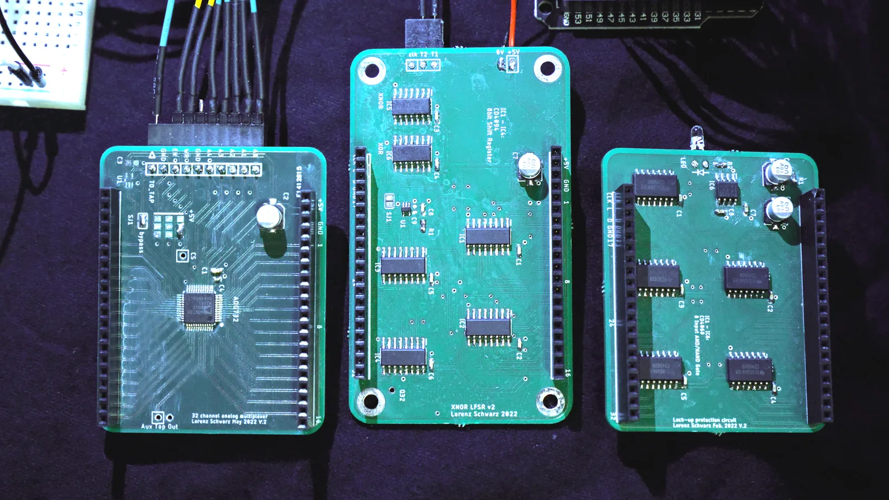

*The three boards of the discrete-logic prototype. © Lorenz Schwarz.*
 
-->

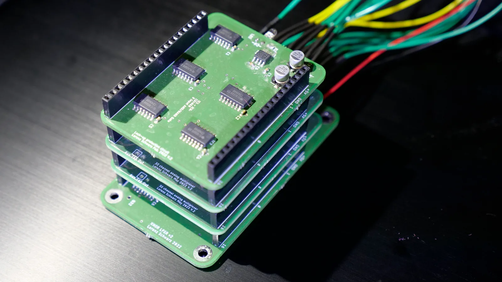

*The assembled stack: shift register, multiplexers, and lock-up protection. © Lorenz Schwarz.*
 

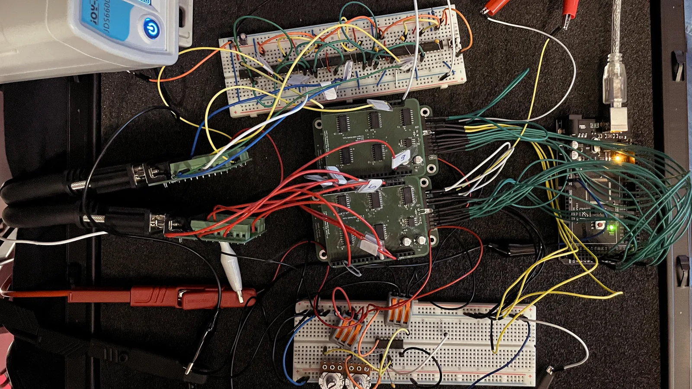

*Testing the system on the bench. © Holger Förterer.*
 

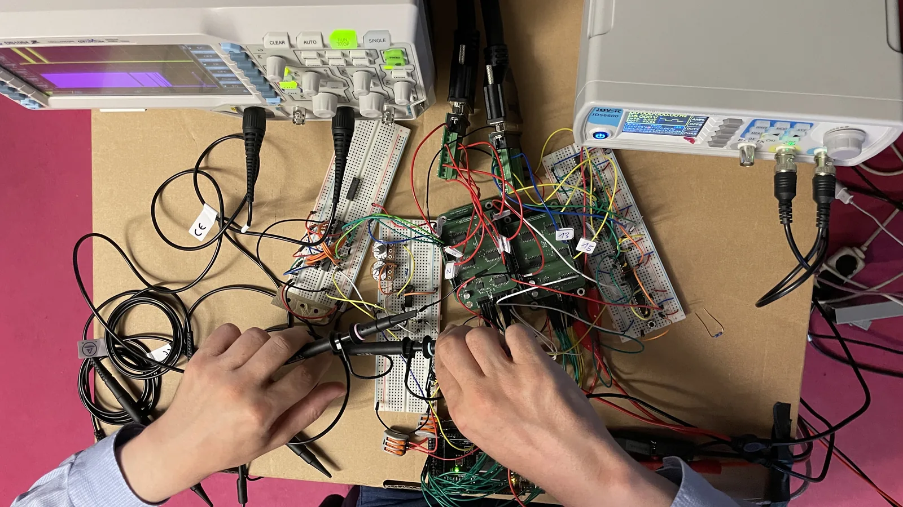

*Testing the boards. © Holger Förterer.*
 

## Publication

Schwarz, Lorenz. "Musical Application of Linear Feedback Shift Registers for Multichannel Loudspeaker Systems." Presented at **AudioMostly 2022**, St.&nbsp;Pölten University of Applied Sciences ([abstract](https://audiomostly.ustp.at/allaroundaudio-abstracts)).

## Further listening

Pieces built on counting, logic, and combinatorial or pseudorandom process, included as background and inspiration:

- Tom Johnson, various works grounded in logic and number.
- Masahiro Miwa, *Four-Bit Counter*.
- Clarence Barlow, *2 aus 13* / *Chronometrie*.
- Robin Minard and Norbert Schnell, *Soundbits*.

## References

A selection of the literature behind the project:

- Alfke, Peter. *Efficient Shift Registers, LFSR Counters, and Long Pseudo-Random Sequence Generators.* Application Note XAPP052, Xilinx, 1996.
- Collins, Nicolas. *Handmade Electronic Music: The Art of Hardware Hacking.* Routledge, 2009.
- Golomb, Solomon W. *Shift Register Sequences.* Aegean Park Press, 1982.
- Horowitz, Paul, and Winfield Hill. *The Art of Electronics.* 3rd ed., Cambridge University Press, 2021.
- Richards, John. "DIY and Maker Communities in Electronic Music." *The Cambridge Companion to Electronic Music*, Cambridge University Press, 2017.
- Roads, Curtis. *Composing Electronic Music: A New Aesthetic.* Oxford University Press, 2015.
- Wendt, Florian, et al. "Perception of Spatial Sound Phenomena Created by the Icosahedral Loudspeaker." *Computer Music Journal*, vol. 44, no. 1, 2017.

## License

The content of this documentation is licensed under the [Creative Commons Attribution 4.0 International license](https://creativecommons.org/licenses/by/4.0/). Copyright remains with the author.
